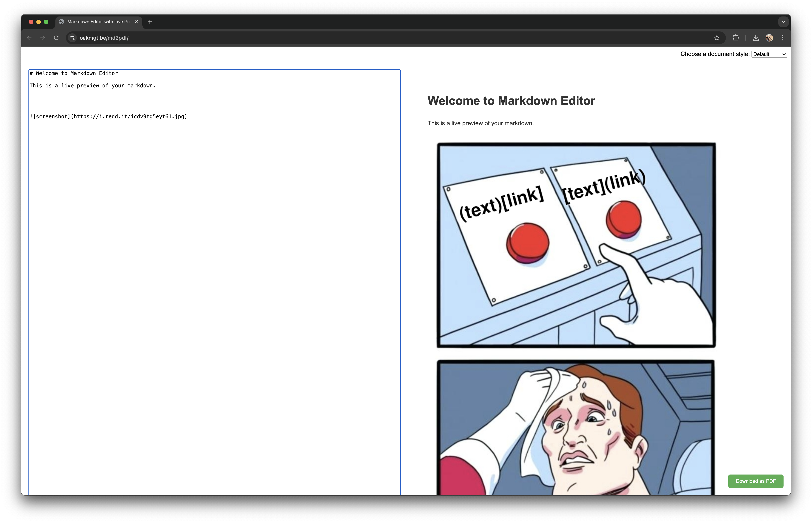

# Markdown Editor with Live Preview and PDF Export

A powerful, browser-based Markdown editor with real-time preview and PDF export functionality.

See a [Live Demo](https://oakmgt.be/md2pdf)



## Features

- 📝 Real-time Markdown rendering
- 🎨 Multiple document themes
- 📄 Export to PDF
- 🔄 Synchronized scrolling
- 💻 Responsive design
- 🚀 No server-side processing required

## Themes

Choose from a variety of document styles to suit your needs:

- Default
- Formal
- Modern
- Elegant
- Professional

## Quick Start

1. Clone this repository:
   ```bash
   git clone https://github.com/oakmgt/md2pdf.git
   cd md2pdf
   ```

2. Start a local server:
   ```bash
   python3 -m http.server
   ```

3. Open your browser and navigate to:
   ```
   http://localhost:8000
   ```

## Usage

1. Enter your Markdown in the left pane.
2. See the rendered HTML in real-time on the right.
3. Choose a theme from the dropdown menu.
4. Click "Download as PDF" to export your document.

## Deploy to GitHub Pages

1. Fork this repository.
2. Go to the "Settings" tab.
3. Scroll down to the "GitHub Pages" section.
4. Select the "main" branch and click "Save".
5. Your Markdown editor will be live at:
   ```
   https://<username>.github.io/mdf2pdf
   ```

## Technologies Used

- HTML5
- CSS3
- JavaScript
- [Marked.js](https://marked.js.org/) for Markdown parsing
- [html2pdf.js](https://ekoopmans.github.io/html2pdf.js/) for PDF generation

## Contributing

Contributions are welcome! Please feel free to submit a Pull Request.

## License

This project is open source and available under the [MIT License](LICENSE).

## Contact

If you have any questions, feel free to reach out to us or open an issue.

Happy Markdown editing! 📝✨
